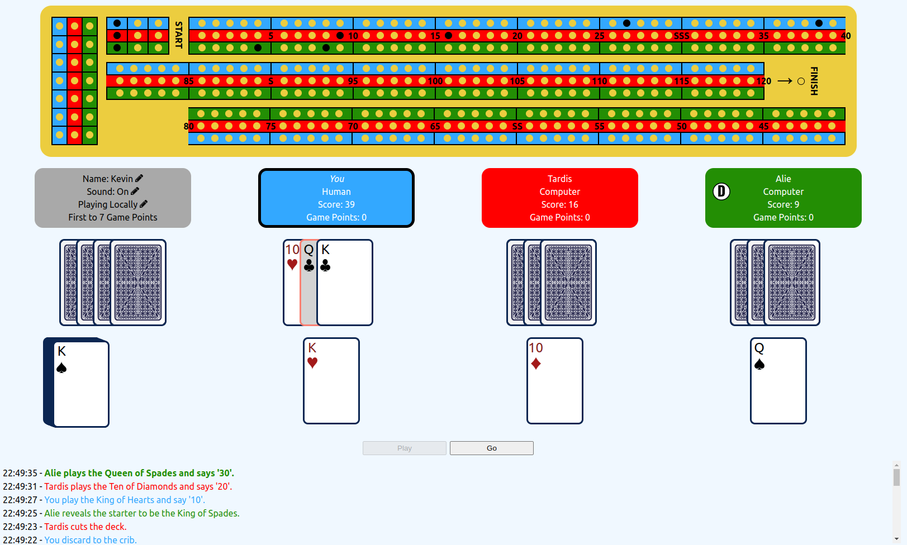

# Cribbage

This is a (mostly complete) single-page application for the card game Cribbage with 2 or 3 players. Users can play locally against up to 2 computer players, or play remotely with other users (still with computer players if desired).

If you want to clone the repository, you'll need to add definitions for `publishKey` and `subscribeKey` at `src/pubnubKeys.js`.

## Play

On GitHub Pages at [https://kr-matthews.github.io/cribbage](https://kr-matthews.github.io/cribbage).

## Features

### Current

- Game-play for 2 or 3 players.
- Computer players which make reasonable (but imperfect) decisions.
- Local or remote play.
- Automatic scoring of all plays, hands, etc. (no option for manually claiming points at this time).
- A match log which records all actions taken in the match.
- Optional sound which says all the key numbers players would normally say in-person.

### Potential Future

See [enhancements](https://github.com/kr-matthews/cribbage/issues?q=is%3Aissue+is%3Aopen+label%3Aenhancement) on GitHub.

- Allow sending of short (possibly predefined) messages, in addition to the automatic match logs.
- Allow manual scoring of everything, and opponents can claim missed points.

## Original Intentions

Quick and clean implementation with proper use of hooks and good separation of concerns. Better management of state shared between users (than Connect 4). (Update: it wasn't quick...)

## Focus

- Sharing state (in particular, deck of cards) across multiple users. (Previous Connect 4 game required extremely simple, straightforward sharing.)
- Separation of concerns, particularly for the `useNetwork` hook.
- Building out core UI before business logic.
- Use of flags for easier testing/debugging; eg flag for making all cards face up.

## Flaws

See the [issues](https://github.com/kr-matthews/cribbage/issues) on GitHub, in addition to the following:

- The styling (css) is not very responsive - especially the scoreboard - and won't work well on smaller screens. In general, it's very basic, and doesn't take advantage of any libraries.
- The scoreboard is supposed to have a couple of curved segments, but only straight segments are used.
- The secret keys for remote play aren't properly secured.
- The UI can be inspected to reveal what cards each player has.
- The deck can similarly be checked via standard Chrome extensions or intercepting the pubnub messages.
- Test coverage is decent but very far from comprehensive, and some tests repeat previous tests making them hard to understand and modify.
- Some files are too large and should be broken up into more manageable pieces.
- A few dependency array issues, mainly involving usages of return arrays/functions from custom hooks.
- Network message handler for incoming messages isn't very robust and can only handle one, so messages will be lost if they come in simultaneously.
- The `useNetwork` hook doesn't track UUIDs of present users, so can't implement kicking out players itself, meaning `App` has to take care of that and separation of concerns blurs a bit here.
- On a similar note, some sound effects happen within the custom hook `useSoundEffects` via side effects, others are explicitly called in the `App`.
- And probably many more...
